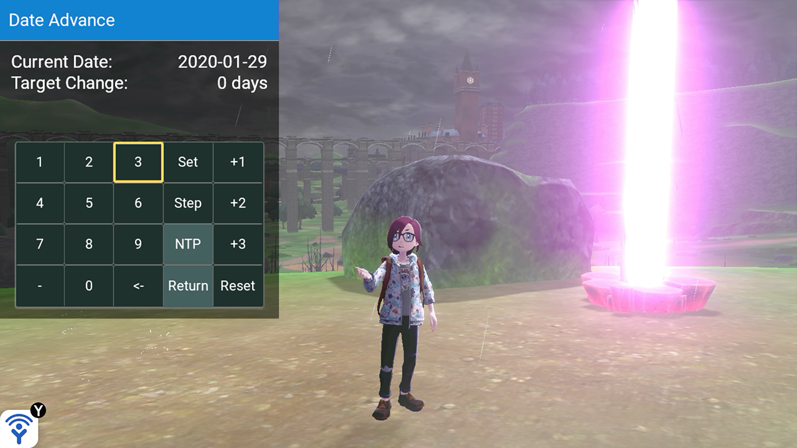

# Luxray

### the Gleam Eyes Pokémon. Its eyes can see through anything. It can even spot its prey hiding in the shadows.

---

Luxray is an overlay utility for Pokémon in the form of a sys-module.

Current Feature
---

- Automatic date advance for RNG manipulation and other time-based events

Usage
---

- Make sure you have the latest version of Atmosphere
- Place all the contents from the release archive on your SD card root
- Open Luxray Launcher from Homebrew Menu and launch Luxray

For detailed usage explanation, please refer to [this page](docs/date_advance.md).  
For further assistance, please join our [Discord server](https://discord.gg/v8Rueaf).

Building
---

- DevkitA64 and libnx
- Recursive clone the repository with SSH
- Run `make`

To-do list:
---

- 0.1.1
  - TBD

- somewhere down the line
  - Add settings page
    - "auto reset after step" could be moved to the settings page
    - make step interval configurable
  - Refactor style code
  - Refactor Makefile
    - Also make dock/handheld build mode output to different build dir
  - Launcher checks for update
    - Maybe a canary update channel?
  - Add lv_btnm edge roll over
  - Switch between DOCKED/HANDHELD without the launcher

- will probably not happen (depending on how much school sucks my time)
  - Info display (reference capture sight?)
    - pokemon info/seed/stuff
  - Routine automation (botbase style?)
    - Host a service for commands over network
    - Simple script engine
