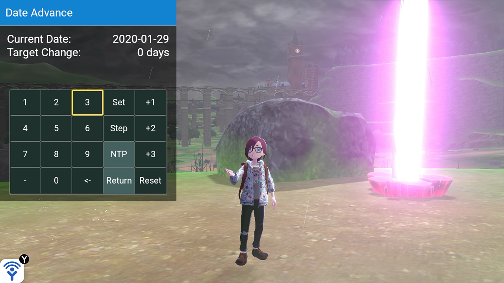

# Date Advance

In the Date Advance screen, you can select any amount of days to change your console date with, and the effect of the date changes will apply in-game without using date exploits.

You can step through each date and advance the in-game days with any amount you set, change the date with the day count directly, reset the date to what you started with, and reset the date to the time queried from ntp.org's server if you are connected to the internet.

## *Warning: do not step large sums of days in the wild area, otherwise the game could get overloaded and result in crashes*

Button functionalities:
---

| Button  | Description   
| ------- | ------------
| Set     | Set the days change directly, and update the "reset date" afterwards
| Step    | Step through each day and advance the game for the set amount of days      
| Reset   | Reset the date to the "reset date" (defaults to the date luxray launched with)
| Return  | Toggle the automatic returning to "reset date" after each step session
| NTP     | Reset the date (and time) to match ntp.org's
| +1/2/3  | Do a short step of 1, 2 or 3 days respectively

Date Advance FAQ
---

- Why do I need time sync on?
  
  Because it is the currently the only way to set all the Switch's internal system clocks so the game thinks a real day has passed.

- Will time sync cause my game to advance naturally?
  
  Yes, but it is avoidable by always setting your time to the same date before launching the game.

- I'm stuck in the future; how do I set the time back?
  
  There is a minus button. Just set a minus amount of days.
